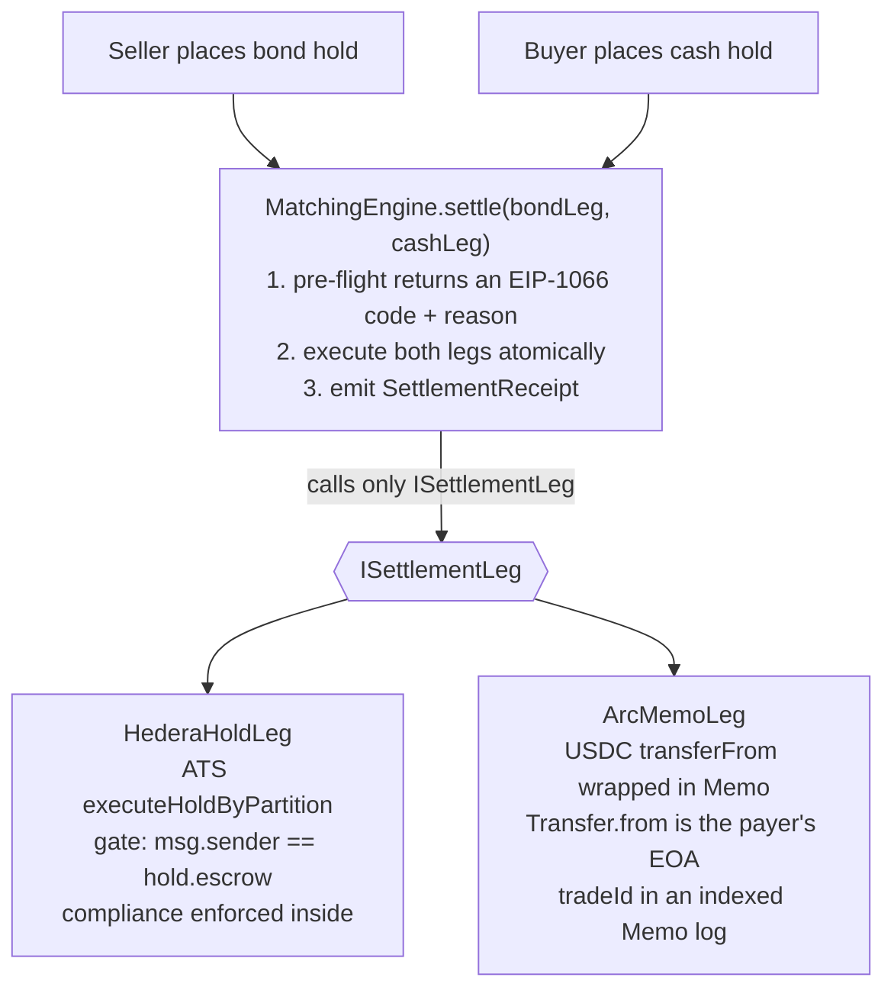

# CLEARING HOUSE

**A tokenised-bond settlement venue where the trade and the cash never move separately.**
Compliance is checked in the same transaction that settles both legs. A separate index that the
venue does not control can confirm no non-compliant trade ever cleared.

> Hedera's Asset Tokenization Studio issues compliant bonds but ships no secondary market ([its docs
> note the gap](https://docs.hedera.com)). CLEARING HOUSE is that market. It needs no permission from
> the issuer.

---

## How it works

The engine settles every trade as two legs and only ever calls the `ISettlementLeg` interface. To
add a payment rail you implement that interface; the engine stays the same.

- The delivery leg is always an ATS `Hold`. Executing it only checks `msg.sender == hold.escrow`, so
  the matcher needs no role or whitelist from the issuer.
- The payment leg is swappable: an ATS deposit token on Hedera, or USDC via `Memo` on Arc. Changing
  the cash rail is a single `setLegs` call.
- Compliance runs inside `executeHoldByPartition`, which carries `onlyCompliant(address(0), _to,
  false)`. A buyer who loses KYC between placing an order and matching cannot be filled.

The ATS and Arc mechanisms are checked against their real source in
[`specs/ats-mechanism.md`](specs/ats-mechanism.md) and [`specs/arc-mechanism.md`](specs/arc-mechanism.md).

---

## Sponsors

**Hedera** - The bond is issued on ATS (ERC-1400/3643), and its `Hold` escrow is what lets a third
party run the secondary market without the issuer's permission. DvP and compliance rejection both
happen on Hedera.

**The Graph** - A subgraph joins two streams, settlements and ATS identity/control events, and
reconstructs each trade's compliance in the mapping. A separate verifier exposes the same check as
an MCP server (`verifier/SKILL.md`), so it can flag the venue if it misreports.

**Arc (Circle)** - The alternate payment rail. `ArcMemoLeg` settles USDC through Arc's `Memo`
contract, so each settlement emits a `Transfer` from the payer's own address plus an indexed `Memo`
carrying the trade id. The payment can then be reconciled to the trade from logs alone.
